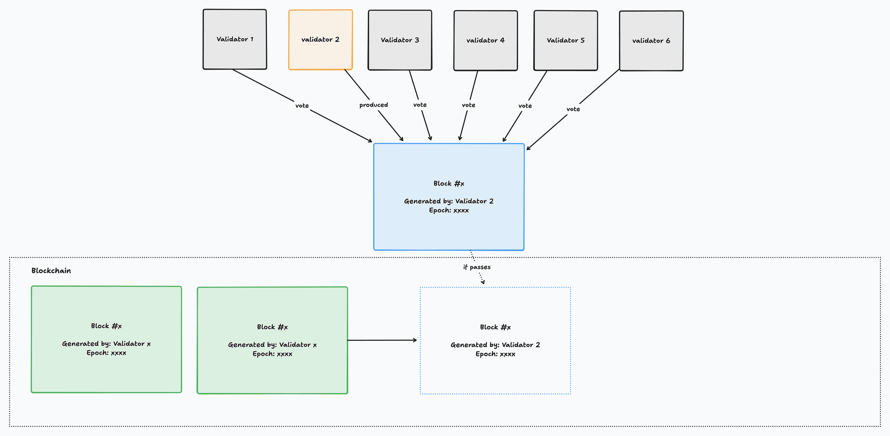
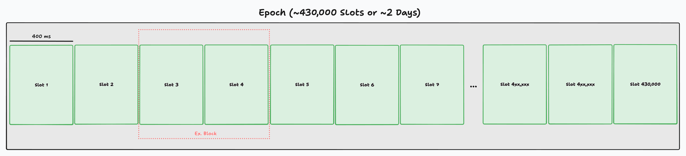
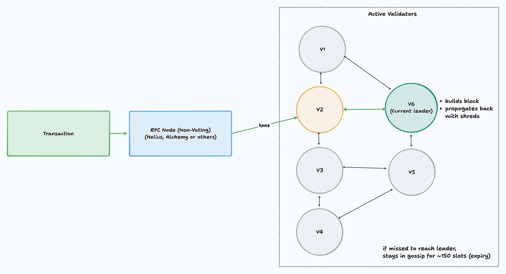

# Introduction
Solana is a very fast blockchain, and it works on a significantly different mechanism than Ethereum or other blockchains. To achieve this high transaction capacity and low latency (tens of thousands of transactions per second), it utilizes the Proof of History (PoH) consensus. 

For any blockchain to run, the miners or validators (in Solana's case) need to build blocks of transactions which are then interlinked to form a chain. These are the very foundation of any blockchain. The miners/validators are physical nodes (machines with very high specifications and fast internet connections) which collect the incoming transactions then start producing the blocks. The way blocks are produced and agreed upon depends on the chain.
The main function of a validator is either to produce a block or to vote on a block, ensuring it does not contain any faulty transactions.

Validators receive rewards for performing this work, which keeps the system running and motivates them to produce and propose new blocks. The rewards vary from blockchain to blockchain. For example, in Bitcoin new BTC gets minted; similarly, in Solana and Ethereum new tokens are also issued along with transaction fees.

## Leader Schedule
The Solana blockchain does not mine blocks the traditional way, they're mined by predetermined leaders with a leader schedule and this helps achieve massive processing capacity. To understand it better we first need to understand the bare basics: 
#### Slot 
A slot in Solana is a unit of time (~400ms) where one validator has the right to produce a block, that validator is called the leader. 
#### Block
Block is a bundle of transactions confirmed in one or more slots. Blocks may span slots if leaders keep extending the ledger. 
#### Epoch
A collection of slots (~432,000 slots, about 2 days). Validator leader schedule is defined per epoch. 

Every epoch, the Solana network pre-determines a sequence of leader validators assigned to each slot. That means for the next ~2-3 days, specific validators are scheduled to produce blocks every 400 ms.

Other validators vote on the block proposed by the leader validator. If the voting passes, the transactions are confirmed and finalized. If the leader misses block production in its assigned slot, the slot is taken over by the next validator in the schedule.

Leaders are determined for an epoch based on their stake. If you have the Solana CLI, you can check the leader schedule for current epoch by running `solana leader-schedule`.

## Block Production
To produce any block, a validator needs to collect all of the incoming transactions in that slot and bundle them in the form of a block.
#### Gossip
On Ethereum, there's a single global mempool. The validators pick the transactions from that mempool. However on Solana, transactions are spread across validators through the **gossip network**, a peer-to-peer protocol where each validator forwards transaction to its neighbors and they forward again. 

This means, each validator sees a slightly different view of the "mempool" (the set of pending transactions in the gossip). There's no single canonical pending transactions list. The faster your transaction reaches the current leader, the higher the chances it gets included in the current slot. 
If a transaction misses the leader's slot, it remains in the gossip and may be picked up by the next leader. Transactions expire after about 150 slots (~1 minute), because each transaction must reference a recent blockhash.

RPC providers like Helius or Alchemy typically run **RPC nodes** (validator clients with RPC enabled, essentially non-voting nodes), whose job is to forward transactions into the gossip network and serve data queries for users and apps.

#### Creating Block
Once the leader has collected transactions from gossip (all referencing a recent blockhash), it bundles them in an order it chooses, this is where MEV comes in play (we'll explore MEV later). 

The leader inserts these transactions into the **PoH (Proof of History) sequence**, which provides a verifiable ordering. Once the block is ready, it is broadcast to other validators in form of shreds.

Other validators verify the block's validity (signatures, balances, program execution etc). If valid, they cast a vote transaction referencing the block's hash. Validator votes are just transactions sent into the network and included in subsequent blocks.

#### Commitment Levels
- **Processed** → The block containing the transaction has been received and executed locally by a validator.

- **Confirmed** → The block has been voted on by a supermajority of validators (>66% of stake).

- **Finalized** → The block is “rooted” (made irreversible) under **[Tower BFT](https://www.helius.dev/blog/consensus-on-solana)**, meaning the network will not roll it back.

## Rewards and Cost
Validators mainly have three types of rewards. They can choose to pass these rewards back to stakers while keeping a portion to cover costs and profit. Validators set a **commission fee** (usually 0–10%), and the rest is distributed to delegators.

1. **Block Rewards** - New SOL tokens minted as inflation rewards, distributed to validators for producing blocks.
2. **Priority Fees (tips from users)** – 100% of the priority fee goes directly to the leader validator who includes the transaction.
3. **MEV Rewards** - With MEV clients (like Jito), validators may receive additional fees for ordering or bundling transactions according to user bids.

As for the costs, there are two types of cost: 
1. **Voting Cost** - Validators have to send a vote transaction every slot (~400ms). Each vote is a normal Solana transaction but that value adds up to about ~1 SOL per day just for the voting fees. This is one of the reasons small validators with less delegation run in loss since they're not leader often and do not generate enough rewards. 
2. **Infra Cost** - Running a performant validator needs a high-performance server machine which should have high cores CPU, lots of RAM and high bandwidth. Depending on the location, network speed, storage costs this can range from 1000-2000$ a month easily. 

# Validator Clients
Validator client is a software that runs the validator node, it handles a lot of things like 
- keeping the latest copy of the blockchain
- consensus participation
- leader duties (producing blocks, distributing shreds) 
- and RPC services

Solana Labs developed the Solana Labs Client `solana-validator` written is Rust. It was highly optimized and performed well, but it created a single-client risk, meaning the whole network relied on one codebase. If a critical bug appeared, the entire network could be affected.

To mitigate this, alternative clients were developed. These are independent implementations of the validator logic, written in different languages or other additional features. 

Currently, there are 2-3 widely used validator clients, while several others in development and research:
1. **[Agave (by Anza)](https://github.com/anza-xyz/agave)** - Production ready mainnet client which is fork of the old Solana Labs validator client written in rust. It is maintained by Anza Labs and run by a lot of validators today. 
2. **[JITO Solana (by Jito Labs)](https://github.com/jito-foundation/jito-solana)** - JITO is a fork of agave with custom patches, it's main focus is at MEVs with support for bundles and auctioning MEV. It's run by validators participating in MEV auctions (Jito Network). 
3. **[Firedance](https://github.com/firedancer-io/firedancer)** - in development by Jump Crypto
4. **[Sig](https://github.com/Syndica/sig)** - validator client implementation written in zig by Syndica

# MEV
MEV (Maximal Extractable Value) is the additional value that block producers can capture by re-ordering, inserting or grouping transactions within a block. In practice, it allows certain transactions to be prioritized or sequenced in a way that benefits the party paying for the ordering.

On Solana, MEV represents a significant source of extra revenue for validators. Validators provide block ordering services to searchers (bots scanning for arbitrage and liquidation opportunities) who pay for transaction placement.

Early Solana validators were doing private mempool deals, where they secretly bundled and prioritized transactions which created an unfair and opaque system since users couldn’t see which transactions were included or how much validators were charging.
##### Jito Client
Jito Labs built an MEV aware validator client by forking agave and adding custom patches to enable transaction auctions, making MEV opportunity fair, more transparent and efficient for everyone. 

With Jito clients, the bots (searchers) or users can build bundles of transactions (eg. arbitrage trades + attached fee) and submit them to the Jito Block Engine. Validators running Jito Solana client receive these bundles during their leader slot and select them based on the highest bid. The winning bundle is included in the block. The validator and delegators get the fee while the user benefits for whatever arbitrage or other opportunity it executed.

Jito clients also helped reduce the spam transactions on the network, because after Jito instead of sending thousands of txns per opportunity they could just pay more in fees to get their transaction included. 

When meme coin trading exploded on solana in the recent years, Jito auctions were heavily used by sniping bots. They paid validators to prioritize their buy transactions in the very first block of trading, meaning the earliest and best entries often went to MEV bots. Similarly in rug pulls, sellers could bundle their transactions across multiple wallets to dump tokens in on shot. 

Other use cases include sandwich attacks and arbitrage: searcher bots monitor gossip for large buy or sell transactions, then pay validators to place a trade immediately before the victim’s transaction (the front-run) and another immediately after (the back-run), extracting profit from the price movement caused by the victim. The same auction mechanism can also be used to capture cross-AMM arbitrage by paying to have the right sequence of trades executed in a single block so the arbitrage opportunity is reliably captured.
Today, a large share of validators run Jito clients, since the MEV rewards boost delegator returns, making their stake more attractive.

###### Jito Block Engine
The Jito Block Engine is the off-chain software that receives MEV bundles from searchers (users). It runs a fair auction for blockspace and forwards the highest paying bundles to validators running the Jito Solana client.

###### Jito Liquid Staking
Jito also operates a liquid staking protocol. When you stake SOL with Jito, you receive JitoSOL(a liquid staking token) in return. JitoSOL holders earn the usual staking rewards plus a share of the MEV rewards generated by validators in the Jito Network.

# Running a Validator
Running a validator is not an easy task, but it can be fruitful in the long run on a blockchain like Solana, which is constantly improving. Getting your own validator up basically means having enough SOL to participate in voting, attracting sufficient stake delegation to become profitable (roughly 50,000 - 60,000 SOL at the time of writing) and maintaining the server for 100% uptime while also troubleshooting and improving things as needed. 

At its core, you're just running the validator software, which automatically pulls chain data, builds block and votes on the blocks etc. But in practice, it requires strong DevOps skills and deep knowledge of the solana network to do it reliably.

From my research, it is extremely difficult for a single person to start and run a profitable validator from scratch. Your validator needs a large amount of stake in order to get enough chances at leader slots. [Dhruv](https://x.com/dhruvsol_) is probably one of the very few individuals running a profitable solo validator. Do checkout his comprehensive guide on [running a validator](https://github.com/brewlabshq/validator-jumpstart). 

##### Solana Foundation Delegation Program
The Solana Foundation operates a Delegation Program to help new validators grow. It matches external stake 1:1 up to 100,000 SOL and covers vote costs for the first year (tapered: 100% → 75% → 50% → 25%). However, the requirements are tough: you must run a performant validator on testnet for >5 epochs, and continue meeting strict performance criteria. Still, if done successfully, this program can accelerate a validator’s growth significantly.

# References & Resources
Validators and the Solana network are a large topic, and there are many areas you can explore beyond what’s covered here. With new validator clients being developed and the network constantly improving, things will continue to evolve. For example, an upcoming major upgrade called **[Alpenglow](https://www.helius.dev/blog/alpenglow?utm_source=chatgpt.com)** proposes replacing parts of the current consensus system (PoH + TowerBFT) with new mechanisms that could bring transaction finality down to ~100–150 ms.

Other topics worth exploring include [Turbine](https://www.helius.dev/blog/turbine-block-propagation-on-solana) and block **shredding**, which together handle efficient block propagation across the Solana network.

Here are some additional resources (thanks to [Sabir](https://x.com/simplysabir_)) you may find useful:
**Tools**
- [Solana Validator Metrics](https://validators.app/)
- [Validator Profit Calculator](https://cogentcrypto.io/ValidatorProfitCalculator)

**Validator Basics & Economics**
- [IceStaking thread on validator economics](https://x.com/icestaking_/status/1892254623328612408)
- [Solana Validator Economics: A Primer (Helius)](https://www.helius.dev/blog/solana-validator-economics-a-primer)
- [Validator node economics discussion (Reddit)](https://www.reddit.com/r/solana/comments/lrjr6l/validator_node_economics/)
- [Validator economics Q&A (StackExchange)](https://solana.stackexchange.com/questions/22615/i-want-understand-validator-economic)
- [Solana Foundation Delegation Program](https://solana.org/delegation-program)
- [Solana Validators Overview](https://solana.com/validators)
- [Validators.app – Example validator profile](https://www.validators.app/validators/SANDCxXBbQhvbUqNtiLqKdFEY1uQhVo1UgUACaS4mXU?locale=en&network=mainnet)

**Guides & Tutorials**
- [How to set up a Solana Validator (Helius)](https://www.helius.dev/blog/how-to-set-up-a-solana-validator)
- [Validator Jumpstart Guide (Cogent Crypto, Medium)](https://medium.com/@Cogent_Crypto/how-to-become-a-validator-on-solana-9dc4288107b7)
- [YouTube: Solana Validator Setup Walkthrough](https://youtu.be/tmRbNXYmp4M?si=JvFvPLoAShs3sqwK)
- [Ryan Chern’s validator insights thread](https://x.com/ryanchern/status/1740204925647520165?s=20)

**Validator Clients & Performance**
- [Agave v23 Update (Helius)](https://www.helius.dev/blog/agave-v23-update--all-you-need-to-know)
- [Solana Performance Engineering (Helius)](https://www.helius.dev/blog/solana-performance-engineering)
- [Alpenglow: Next-gen Solana Consensus (Helius)](https://www.helius.dev/blog/alpenglow?utm_source=chatgpt.com)

**Liquid Staking & Staking**
- [Sanctum Docs (LSTs on Solana)](https://learn.sanctum.so/docs)
- [What is hSOL? (Helius)](https://www.helius.dev/blog/what-is-hsol)
- [LSTs on Solana (Helius)](https://www.helius.dev/blog/lsts-on-solana)
- [Solana Staking Simplified (Helius)](https://www.helius.dev/blog/solana-staking-simplified-guide-to-sol-staking)

**Deep Dives**
- [Under the Hood of Solana Program Execution](https://ubermensch.blog/under-the-hood-of-solana-program-execution-from-rust-code-to-sbf-bytecode)
- [ETH Is Not Ultrasound Money (dba.xyz)](https://dba.xyz/eth-is-not-ultrasound-money/)

**Other References**
- [Solana Docs: Terminology](https://solana.com/docs/references/terminology)